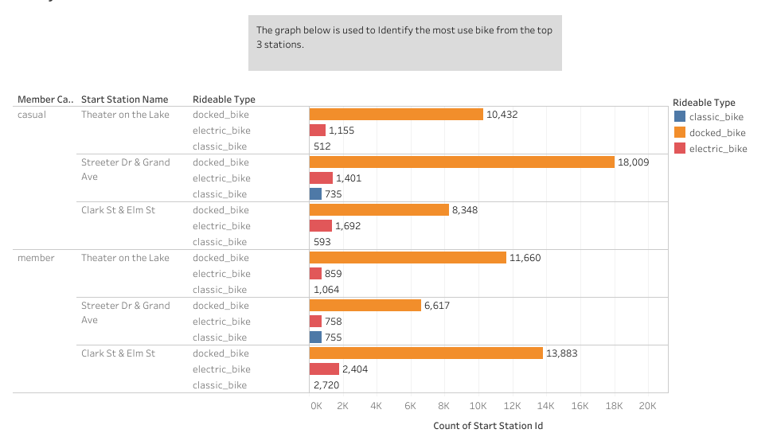

Hi everyone, over the last few months, I've been working on the Google Data Analytics Professional Certificate through Coursera. This capstone project is the final project in my Google Data Analytics Professional Certificate course. In this case study, we tasked to analyse a public dataset for a fictional company provided by the course. I used R programming language and R markdown for data analysis and presentation, and then Tableau for visualizations.

About the company
In 2016, Cyclistic launched a successful bike-share offering having a fleet of 5,824 bicycles that are tracked and locked into a network of 692 stations across Chicago. The bikes can be unlocked from one station and returned to any other station in the system at any time.

__Riders who have an annual subscription are called members__ while riders who are __single-ride or full-day pass users are considered casual riders__.

The director of marketing is looking to maximize the number of annual memberships as they are more profitable than single-ride or full-day passes. This strategy is believed to be the key to future growth.

The following data analysis steps will be followed:
Ask, Prepare, Process, Analyze, Share, Act.

### Ask
The questions that need to be answered are:

How do annual members and casual riders use Cyclistic bikes differently?
Why would casual riders buy Cyclistic annual memberships?
How can Cyclistic use digital media to influence casual riders to become members?

### Prepare
The dataset follows the ROCCC Analysis as described below:

Reliable - yes, not biased

Original - yes, can locate the original public data

Comprehensive - yes, not missing important information

Current - yes, updated monthly

Cited - yes

I will be using the public dataset located [here](https://divvy-tripdata.s3.amazonaws.com/index.html). The data has been made available by Motivate International Inc. 

Key Tasks Followed:

Downloaded data and copies have been stored on the computer.
I have downloaded the data for April 20 to March 21 which is a 12 months Period.
The data is in CSV (comma-separated values) format, and there are a total of 13 columns.
Installing and loading necessary packages

install packages and loading libraries
```
install.packages("tidyverse")
install.packages("geosphere")
install.packages("janitor") # to remove empty cols and rows
install.packages("lubridate") # to pass date and time
install.packages("dplyr")
install.packages("ggplot2")

```
```{r,message=FALSE,results='hide'}
library(tidyverse)
library(lubridate)
library(janitor)
library(geosphere)
library(readr)
library(dplyr)
library(ggplot2)
```
import data to R studio

```{r,message=FALSE,results='hide'}
df1 <- read_csv("202004-divvy-tripdata.zip")
df2 <- read_csv("202005-divvy-tripdata.zip")
df3 <- read_csv("202006-divvy-tripdata.zip")
df4 <- read_csv("202007-divvy-tripdata.zip")
df5 <- read_csv("202008-divvy-tripdata.zip")
df6 <- read_csv("202009-divvy-tripdata.zip")
df7 <- read_csv("202010-divvy-tripdata.zip")
df8 <- read_csv("202011-divvy-tripdata.zip")
df9 <- read_csv("202012-divvy-tripdata.zip")
df10 <- read_csv("202101-divvy-tripdata.zip")
df11 <- read_csv("202102-divvy-tripdata.zip")
df12 <- read_csv("202103-divvy-tripdata.zip")
```

Combine the data sets to one data frame using r bind function

```{r,message=FALSE}
bike_data <- rbind(df1,df2,df3,df4,df5,df6,df7,df8,df9,df10,df11,df12)
#bike_data <- read_csv("bike_data.csv")
```

### PROCESS

  * Remove empty columns and rows using janitor
  * Omit null values.
```{r}
bike_data <- janitor:: remove_empty(bike_data, which = c("cols"))
bike_data <- janitor:: remove_empty(bike_data, which = c("rows"))
bike_data = na.omit(bike_data) # the number of entries was reduced by 195 057 after omitting null values from the data. 
```
check the dimensions 

```{r}
dim(bike_data)
```

Add new columns. parse time in hours, start date and end date, weekdays as well as months using lubridate.
Also, Calculate the trip duration in seconds, trip distance in meters. adding 8 columns in total.

```{r}
bike_data$start_date <- as.Date(bike_data$started_at)
bike_data$end_date <- as.Date(bike_data$ended_at)
bike_data$months <- months(as.POSIXct(bike_data$started_at),abbreviate = T)
bike_data$weekdays <- weekdays(as.POSIXct(bike_data$started_at),abbreviate = T)
bike_data$start_hour <- lubridate::hour(bike_data$started_at)
bike_data$end_hour <- lubridate::hour(bike_data$ended_at)
bike_data$trip_duration <- difftime(bike_data$ended_at,bike_data$started_at,"min")
bike_data$distance_travelled <- distHaversine(cbind(bike_data$start_lng,bike_data$start_lat), cbind(bike_data$end_lng,bike_data$end_lat))

```

Check if all the column have been added to the data frame

```{r}
dim(bike_data)
```

### data cleaning

 Remove dirty data. all entries that have a trip duration less or equal to zero seconds are removed,
 distance traveled less or equal to zero meters are filtered out as well.
```{r}
 clean_bike_data <- bike_data%>%
  filter(trip_duration >0)%>%
  filter(distance_travelled >0)%>% #initially, we had 3 294 691 entries and then after the filters were applied the number dropped to 3 282 054 (by 12 637) 

  filter(trip_duration <= 86400)
```

trip duration more than 24 hours are filtered out as they may haves forgotten to
register them on their return.


remove Null values again to keep the data clean.
```{r}
clean_bike_data <- na.omit(clean_bike_data)
```

Checking if there are any duplicate ride_ids.

```{r}
sum(duplicated(clean_bike_data$ride_id))
```

### Analysis

*Key tasks*

* Aggregate your data so it’s useful and accessible.
* Organize and format your data.
* Perform calculations.
* Identify trends and relationships.

__compare casual and annual riders.__

```{r}
clean_bike_data%>%group_by(member_casual)%>% summarise(n=n())%>%
  mutate(percentage = n*100/sum(n))
ggplot(clean_bike_data,aes(x=member_casual))+geom_bar()+labs(title = "number of rides :members vs casual")

```
__Graph 1__


from graph 1 above and the table above, we notice that 61.8% of the trips are taken by members and the remaining 38.2% by casual riders.

__compare the average trip duration for both casual and annual riders__

```{r,message=FALSE}
bar <- clean_bike_data%>%group_by(member_casual) %>% summarise(avg_ride_length= mean(trip_duration))
bar
ggplot(bar,aes(x = member_casual,y =avg_ride_length,fill = member_casual))+ geom_col()+labs(title = "trip duration :members vs casual")
```
__Graph 2__

from above, we can see that casual riders spend more time on the bikes compared to members.


__compare bikes types__

```{r}
bikes <- clean_bike_data%>%group_by(rideable_type)%>%summarise(n=n())%>%
  mutate(percentage = n*100/sum(n))
bikes
ggplot(bikes,aes(x=rideable_type,y =n ))+geom_col()+labs(title = "rideable types of bikes")
```
__Graph 3__

*From graph 3 above, it's clear that the company has*

  * classic_bike       9.92%
  * docked_bike        76.0%
  * electric_bike      14.1%
  
  most of which are docked bikes. __the company can use that fact to try and convert casual riders into becoming__
  __members, but that's if casual riders use a good potion of that 76%__
  


__Analyse the choice of bikes by users__

```{r,message=FALSE}
rideable_type <- clean_bike_data %>% group_by(member_casual,rideable_type) %>% 
  summarise(n=n())%>%
  mutate(percent = n*100/sum(n))
rideable_type
```
Visual representation for the results above.

```{r}
ggplot(rideable_type,aes(x=member_casual,y = percent,fill = rideable_type)) + geom_col(position = "dodge")+labs(title = "diff types rideable bikes among members and casuals")
```
__Graph 4__

From graph 4, we can see that casual riders used  docked bikes on 918 599 occasions, which is 80% of the rides they've taken.
while members on the other hand used docked bikes 1 359 014 times, which is 73.4% of their total number of rides.

from this insight we can see that, __from that 76%__ use of docked bikes mentioned above, __40,33%__ is used by casual riders and then members use the remaining 59.66% of that ...
(docked bikes used by casuals/total number of docked bikes)*100 = 40,33%. 

the company should then limit the number of docked bikes accessible to casual riders when they need them the most.
that decision could make them consider getting annual membership instead.

### DATA VISUALIZATION

Arrange weekdays and months in order

```{r}
clean_bike_data$weekdays<- factor(clean_bike_data$weekdays, levels= c("Mon", "Tue","Wed","Thu","Fri","Sat","Sun"))
clean_bike_data$months <- factor(clean_bike_data$months, levels = c("Jan","Feb","Mar","Apr","May","Jun","Jul","Aug","Sep","Oct","Nov","Dec"))
```
use of ggplot 2 to count number of trips over a week

```{r}
ggplot(clean_bike_data,aes(weekdays,fill = member_casual)) +
  geom_bar(position = "dodge")+
  theme(axis.text.x = element_text(angle = 60))+
  labs(title = "comparing number of trips taken by members vs casual riders", x = "weekdays", y = "count")
```
__Graph 5__

* from above, we can see that members have more trips on an overage day
 
Now compare the number of trips among users for different bikes to see when casual riders use docked bikes the most
 
```{r}
ggplot(clean_bike_data,aes(weekdays,fill = member_casual)) +
  geom_bar(position = "dodge")+
  facet_wrap(~rideable_type)+
  theme(axis.text.x = element_text(angle = 60))+
  labs(title = "comparing number of trips taken by members vs casual riders", x = "weekdays", y = "count")
```
 __Graph 6__
  
   * From graph 6 above, it is confirmed that members have more rides than casuals. however,
   * we notice that casual riders use more docked bike on Fridays compared to members
   * in an attempt to convert casuals to members, one can limit the number of docked bikes 
     accessible to casuals on especially Fridays of every week.
     
__Now lets find out where else can the limit the number of docked bikes accessible to casuals.__

Let's see at what time of the day do they use these bikes the most.

```{r}
ggplot(clean_bike_data,aes(start_hour,fill = member_casual))+
  geom_bar(position = "dodge")+
  theme(axis.text = element_text(angle =45))+
  labs(title = " Numb of trips taken by casual and annual riders by start hour",x = "start hour",y="count")
```
__graph 7__

 We notice the distribution looks similar among these two groups
 
 Now let's create a plot that groups them by the bikes they use.

```{r}
ggplot(clean_bike_data,aes(start_hour,fill = member_casual))+
  geom_bar(position = "dodge")+
  facet_wrap(~rideable_type)+
  theme(axis.text = element_text(angle =45))+
  labs(title = " Numb of trips taken by casual and annual riders by start hour",x = "start hour",y="count")

```
__graph 8__

* From the above plot, we see that there's a high demand of bikes for both members and casual riders from 16H00 to 18H00.
* For this reason, i would advise that the company should priorities members during this time and limit the number of docked
bikes accessible to casual riders because this is where they need them the most.

___________


*Counting the number of trips for both members and casual riders over the past 12 months*

```{r}
ggplot(clean_bike_data,aes(months,fill = member_casual))+
  geom_bar(position = "dodge")+
  theme(axis.text = element_text(angle =45))+
  labs(title = " Numb of trips taken by casual and annual riders over the last 12 months",x = "weekdays",y="count")
```
__graph 9__

From above we see the distribution looks similar for casual and members.
  
Compare by rideable type

```{r}

ggplot(clean_bike_data,aes(months,fill = member_casual))+
  geom_bar(position = "dodge")+
  facet_wrap(~rideable_type)+
  theme(axis.text = element_text(angle =90))+
  labs(title = " Numb of trips taken by casual and annual riders over the last 12 months",x = "weekdays",y="count")

```
__graph 10__

 * graph 10 above reveals that almost no one is using both classic and electric bikes in winter seasons. 
 * in an attempt to convert casuals to members, docked bikes should again prioritize members during this period
 
___________

Compare the trip distance by casuals and members over a week

```{r}
ggplot(clean_bike_data,aes(x=weekdays,y=distance_travelled,fill = member_casual))+
  geom_col(position = "dodge")+
  facet_wrap(~rideable_type)+
  theme(axis.text.x = element_text(angle = 60))+
  labs(title = "comparing the distance travelled by members vs casual riders", x = "weekdays", y = "distance travelled")
```
__Graph 11__

  * From graph 11 above, we notice that casual riders take longer trips on average except with docked bikes on Fridays.
  * One can use that insight and decide to increase the price per mile especially on the bikes that they need
  the most.
  this should not affect members as they only pay once a year.
  
 
*Now we compare trip duration*

```{r, message=FALSE}
ggplot(clean_bike_data,aes(x=weekdays,y=trip_duration,fill = member_casual))+ 
  geom_col(position = "dodge")+
  facet_wrap(~rideable_type)+
  theme(axis.text.x = element_text(angle = 45))+
  labs(title = "comparing the trip duration for members and casual riders", x = "weekdays", y = "trip duration")
```
__graph 12__

 * here we can see that members and casual riders spend roughly the same time on bikes even though
   casual riders travel longer distances compared to members.
 * this insight is not going to help us convert casuals to members.
 
______

Now lets see which stations are the most common.(this analysis was done in tableau)


   
   
   
  The graph above shows the analysis from the three most used stations by both casuals and members.
  from that we see casuals tend to use more docked bike from Streeter Dr & Grand Ave(18 009 rides)
  than members from any station. docked bikes are mostly used by casual riders on the most popular stations.
  
## Conclusion 
  
To convert casual riders into annual members, the following marketing strategies can be implemented:

* Prioritize annual members during summer seasons.

* Limit the number of docked bikes accessible to casual riders on Fridays as well as on weekdays from 16H00 to 18H00

* Limit the number of bikes, specially docked bikes accessible to casual riders from the top stations including
  Streeter Dr & Grand Ave.


Thanks for Reading, Please provide your feedback.


...


